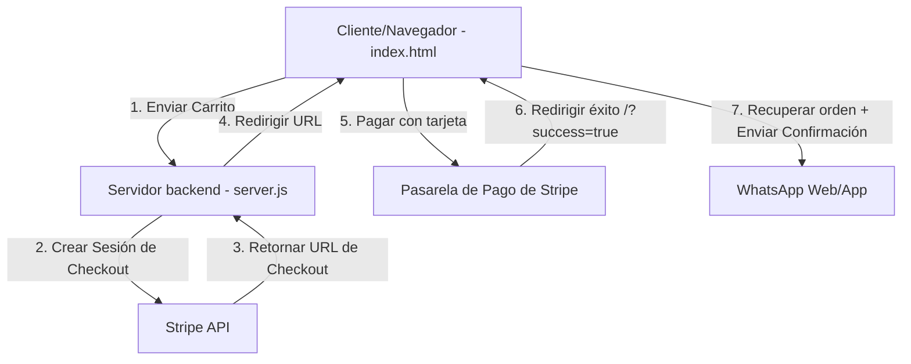

# Diseño de Integración de Stripe - Spicy Wings

Este documento describe la especificación técnica y de arquitectura para integrar cobros seguros por tarjeta a través de Stripe en la plataforma Spicy Wings, manteniendo el flujo de entrega final por WhatsApp.

## 1. Arquitectura del Sistema

Dado que Spicy Wings es actualmente un sitio web estático (HTML, CSS, JS del lado del cliente) y que la clave secreta de la API de Stripe no debe ser expuesta bajo ninguna circunstancia en el navegador, introduciremos un servidor backend ligero en Node.js y Express.

El flujo de componentes funcionará de la siguiente manera:



## 2. Cambios en el Backend (Nuevo Componente)

### [NEW] [package.json](file:///c:/Users/Perez/OneDrive/Escritorio/Projects/spicywings/package.json)
Contendrá las dependencias básicas necesarias para levantar el servidor Express y comunicarse con Stripe:
```json
{
  "name": "spicywings-backend",
  "version": "1.0.0",
  "description": "Backend para procesamiento de pagos de Stripe en Spicy Wings",
  "main": "server.js",
  "scripts": {
    "start": "node server.js",
    "dev": "nodemon server.js"
  },
  "dependencies": {
    "cors": "^2.8.5",
    "dotenv": "^16.4.5",
    "express": "^4.19.2",
    "stripe": "^15.12.0"
  },
  "devDependencies": {
    "nodemon": "^3.1.0"
  }
}
```

### [NEW] [.env](file:///c:/Users/Perez/OneDrive/Escritorio/Projects/spicywings/.env)
Archivo para almacenar las variables de entorno locales de desarrollo de forma segura:
```env
PORT=3000
STRIPE_SECRET_KEY=sk_test_... # Clave secreta proporcionada por el usuario o Stripe MCP
STRIPE_PUBLISHABLE_KEY=pk_test_...
```

### [NEW] [server.js](file:///c:/Users/Perez/OneDrive/Escritorio/Projects/spicywings/server.js)
Servidor Node.js que:
1. Levanta en el puerto `3000` (o el configurado en `.env`).
2. Sirve los archivos estáticos del frontend (la raíz del proyecto) para evitar problemas de origen cruzado (CORS).
3. Expone la ruta `POST /api/create-checkout-session`.

**Lógica de `/api/create-checkout-session`:**
- Recibe un arreglo de productos del carrito: `{ items: [ { name, price, qty, option } ] }`.
- Convierte cada producto en el formato requerido por Stripe:
  ```javascript
  const lineItems = items.map(item => ({
    price_data: {
      currency: 'mxn',
      product_data: {
        name: item.name + (item.option ? ` (Salsa: ${item.option})` : ''),
      },
      unit_amount: Math.round(item.price * 100), // Stripe requiere centavos
    },
    quantity: item.qty,
  }));
  ```
- Crea la sesión de Stripe Checkout indicando las URLs de retorno:
  ```javascript
  const session = await stripe.checkout.sessions.create({
    payment_method_types: ['card'],
    line_items: lineItems,
    mode: 'payment',
    success_url: `http://localhost:3000/index.html?success=true&session_id={CHECKOUT_SESSION_ID}`,
    cancel_url: `http://localhost:3000/index.html?cancel=true`,
  });
  ```
- Devuelve `{ url: session.url }`.

---

## 3. Cambios en el Frontend (Modificación)

### [MODIFY] [index.html](file:///c:/Users/Perez/OneDrive/Escritorio/Projects/spicywings/index.html)

#### A. Carga de la biblioteca Stripe.js
Se agregará en el `<head>`:
```html
<script src="https://js.stripe.com/v3/"></script>
```

#### B. Modificaciones en la Modal de Confirmación
En la modal `#checkout-modal`, se agregará soporte para seleccionar Stripe como método de pago o se añadirá un botón específico de pago:
```html
<div class="form-group">
    <label>Método de Pago:</label>
    <div class="payment-methods" style="display: flex; gap: var(--spacing-md); margin-top: var(--spacing-xs);">
        <label class="radio-label">
            <input type="radio" name="payment-method" value="stripe" checked>
            <span>💳 Tarjeta (Stripe)</span>
        </label>
        <label class="radio-label">
            <input type="radio" name="payment-method" value="efectivo">
            <span>💵 Efectivo al recibir</span>
        </label>
    </div>
</div>
```

#### C. Flujo de Control en JavaScript (Lógica Integrada)
Modificaremos la lógica del evento `submit` del formulario de checkout en el script:
1. **Verificar método de pago seleccionado**:
   - Si es `efectivo`, procede con el envío directo a WhatsApp como antes.
   - Si es `stripe`, inicia el proceso de pago.
2. **Proceso de Pago con Stripe**:
   - Guarda los detalles de envío/recogida (`nombre`, `método de entrega`, `dirección`, `notas`) junto con el `carrito` actual en `localStorage` bajo claves específicas (ej. `spicywings_pending_checkout` y `spicywings_pending_cart`).
   - Envía los artículos mediante `fetch` a `/api/create-checkout-session`.
   - Redirige la ventana a la URL devuelta por el servidor.
3. **Mapeo y Detección de Éxito (`success=true`) al cargar la página**:
   - Al cargar la página, se analizará `window.location.search`.
   - Si se encuentra `success=true` y existe una sesión activa guardada en `localStorage`:
     - Se mostrará una alerta o modal visual de pago exitoso.
     - Se llamará a `sendOrderToWhatsApp()`, pero con un formato que incluye el ID de sesión de Stripe y el estado **"PAGO CONFIRMADO CON STRIPE"**.
     - Se limpiará el `localStorage` de la orden pendiente y del carrito.
     - Se removerán los parámetros de la URL usando `window.history.replaceState` para evitar reenvíos accidentales.
   - Si se encuentra `cancel=true`:
     - Se mostrará una alerta indicando que el pago fue cancelado o rechazado, restaurando el carrito para permitir reintentos.

---

## 4. Plan de Verificación y Pruebas

### Pruebas de Desarrollo Local
1. **Configuración Inicial**:
   - Instalar dependencias con `npm install`.
   - Iniciar el servidor local ejecutando `npm run start` o `node server.js`.
2. **Prueba de Creación de Sesión**:
   - Agregar artículos al carrito y seleccionar "💳 Tarjeta (Stripe)".
   - Confirmar redirección a la página de Stripe Checkout en modo de prueba (`test mode`).
3. **Prueba de Pago Exitoso**:
   - Usar la tarjeta de pruebas de Stripe (`4242 4242 4242 4242`).
   - Confirmar redirección exitosa de vuelta a `index.html?success=true`.
   - Confirmar que se abre la aplicación de WhatsApp con el mensaje estructurado de confirmación de pago y que el carrito se limpia.
4. **Prueba de Cancelación**:
   - En la página de Stripe Checkout, hacer clic en regresar.
   - Confirmar retorno a `index.html?cancel=true` con el carrito intacto y mensaje de advertencia oportuno.
